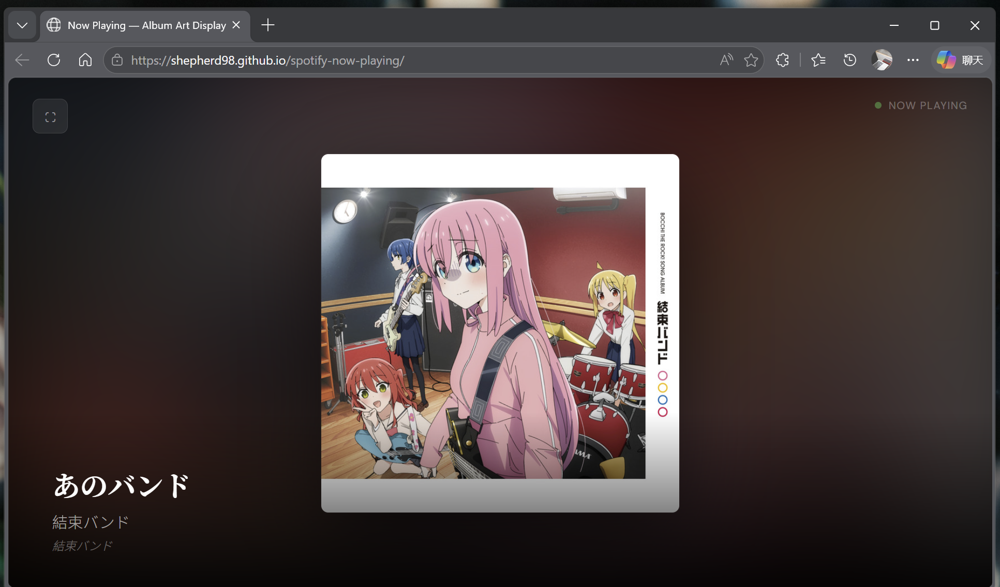
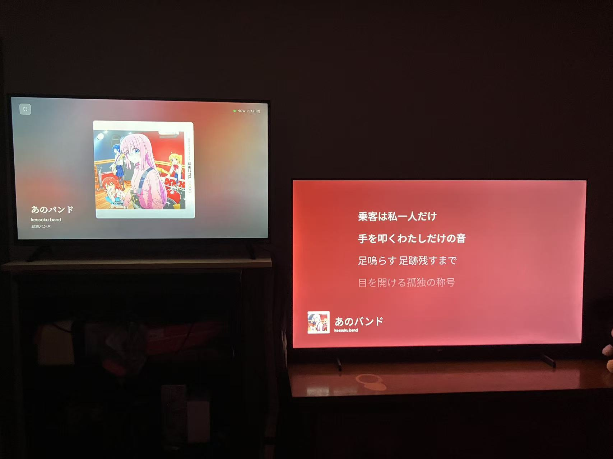

# Now Playing — Spotify Album Art Display

  
  

> [中文](#中文) | [English](#english)

---

## English

A minimal, fullscreen web app that displays your currently playing Spotify album art in real time. Designed for a second screen, ambient display, or Fire TV Stick setup.

### Features

- Fullscreen album art with blurred background glow
- Smooth crossfade transition on track change
- Track info overlay (song, artist, album) appears on hover, auto-hides after 5 seconds
- Cursor auto-hides after 3 seconds of inactivity
- Bilingual UI (中文 / English)
- Auto token refresh — log in once, stay connected

### Setup

#### 1. Create a Spotify App

Go to [Spotify Developer Dashboard](https://developer.spotify.com/dashboard) and create a new app.

- Set **Redirect URI** to your deployed page URL (e.g. `https://yourusername.github.io/spotify-now-playing/`)
- Copy your **Client ID**

#### 2. Deploy

You can access https://shepherd98.github.io/spotify-now-playing/ to use it. Or:
This is a single HTML file with no build step. You can host it anywhere:

**GitHub Pages (recommended):**

1. Fork or clone this repo
2. Go to repo **Settings → Pages → Source → GitHub Actions**
3. Choose **Static HTML**, commit the workflow
4. Your site will be live at `https://yourusername.github.io/spotify-now-playing/`

**Or simply open `index.html` locally** — just make sure the Redirect URI in your Spotify app matches your local address.

#### 3. Connect

1. Open the deployed page
2. Paste your Spotify Client ID
3. Click **Connect Spotify** and authorize
4. Start playing music on any Spotify device — the album art will appear automatically

### Use on Fire TV Stick

1. Open **Silk Browser** on your Fire TV Stick
2. Navigate to your deployed URL
3. Log in once with your Client ID
4. Go fullscreen
5. To prevent screensaver interruption: **Settings → Display & Sounds → Screensaver → Start Time → Never**

### How It Works

- Uses Spotify Web API with **OAuth 2.0 PKCE** flow (no backend required)
- Polls `GET /v1/me/player/currently-playing` every 3 seconds
- Displays the highest resolution album art (640×640) with a CSS blur background layer
- Automatically refreshes the access token using the stored refresh token

### Tech Stack

HTML / CSS / JavaScript — single file, no dependencies, no build tools.

---

## 中文

一个极简的全屏网页应用，实时显示你正在播放的 Spotify 专辑封面。专为第二块屏幕、氛围显示屏或 Fire TV Stick 设计。

### 功能特性

- 全屏显示专辑封面，背景带模糊光晕效果
- 切歌时平滑淡入淡出过渡
- 鼠标悬停显示歌曲信息（歌名、歌手、专辑），5 秒后自动隐藏
- 鼠标 3 秒无操作自动隐藏光标
- 双语界面（中文 / English）
- 自动刷新 Token，登录一次即可持续使用

### 配置步骤

#### 1. 创建 Spotify 应用

前往 [Spotify Developer Dashboard](https://developer.spotify.com/dashboard) 创建一个新的 App。

- 将 **Redirect URI** 设置为你部署后的页面地址（例如 `https://你的用户名.github.io/spotify-now-playing/`）
- 复制 **Client ID**

#### 2. 部署
你可以直接访问 https://shepherd98.github.io/spotify-now-playing/ 或者：

本项目是一个纯静态 HTML 文件，无需构建，可以部署在任何地方：

**GitHub Pages（推荐）：**

1. Fork 或 Clone 本仓库
2. 进入仓库 **Settings → Pages → Source → GitHub Actions**
3. 选择 **Static HTML**，提交 workflow
4. 页面将部署在 `https://你的用户名.github.io/spotify-now-playing/`

**或者直接本地打开 `index.html`** —— 确保 Spotify App 中的 Redirect URI 与你的本地地址一致即可。

#### 3. 连接

1. 打开部署好的页面
2. 粘贴你的 Spotify Client ID
3. 点击 **连接 Spotify** 并完成授权
4. 在任意设备上播放 Spotify 音乐，专辑封面会自动显示

### 在 Fire TV Stick 上使用

1. 打开 Fire TV Stick 上的 **Silk 浏览器**
2. 访问你部署好的页面地址
3. 输入 Client ID 登录一次
4. 全屏显示
5. 防止跳屏保：**Settings → Display & Sounds → Screensaver → Start Time → Never**

### 工作原理

- 使用 Spotify Web API，采用 **OAuth 2.0 PKCE** 授权流程（无需后端服务器）
- 每 3 秒轮询 `GET /v1/me/player/currently-playing` 接口
- 获取最高分辨率的专辑封面（640×640），配合 CSS 模糊背景层显示
- 使用 Refresh Token 自动刷新 Access Token，无需反复登录

### 技术栈

HTML / CSS / JavaScript —— 单文件，零依赖，无需构建工具。

---

## License

MIT
